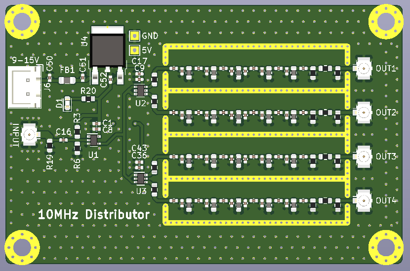
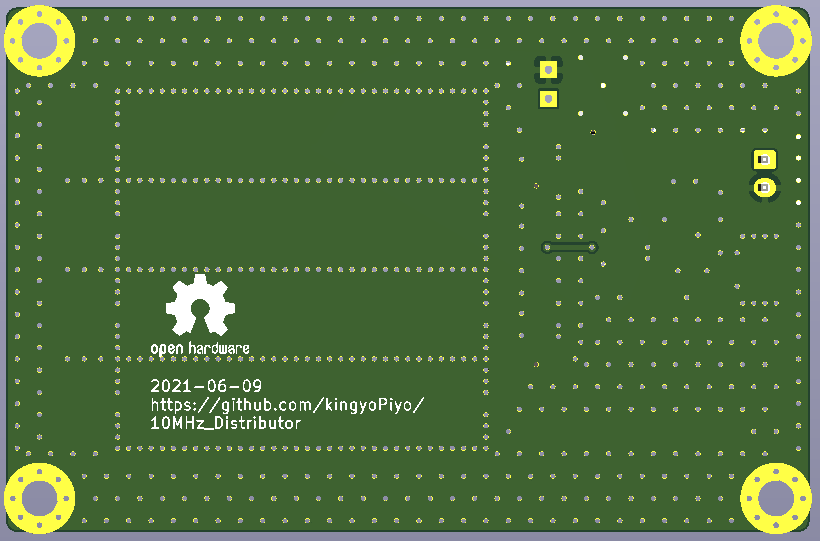

# 10MHz_Distributor
GPSDOなどの10MHz基準信号の分配基板です。  
出力部に5段のBPFを搭載しており、入力信号をバッファリング＆正弦波へ波形整形してから出力します。 
 
  
  

# 諸特性
・・・部品到着、組み立て後に詳細測定予定・・・  

|  項目  |  仕様 |  備考  |
| ---------- | ------ | ------------- |
|  電源電圧  |  9 ～ 15 V  | NJM7805耐圧は35V |
|  消費電流  |  約 xx mA  | 電源電圧12V, 4出力50Ω終端時 |
|  入力インピーダンス  |  約 xxx Ω  | R19にて50Ω終端可 |
|  入力信号レベル  |  xx ～ xx Vp-p  |  |
|  出力インピーダンス  |  50 Ω  |  |
|  出力信号レベル  |  xx ～ xx dBm  | 50Ω終端時 |
|  スプリアスレベル  |  < -xx dBm (2nd) < -xx dBm (3rd) < -xx dBm (4th)  | 50Ω終端時 |
|  SSB位相雑音  |  -xx dBc/Hz 10kHz offset -xx dBc/Hz 30kHz offset -xx dBc/Hz 100kHz offset  | 50Ω終端時 入力信号はxxx |
