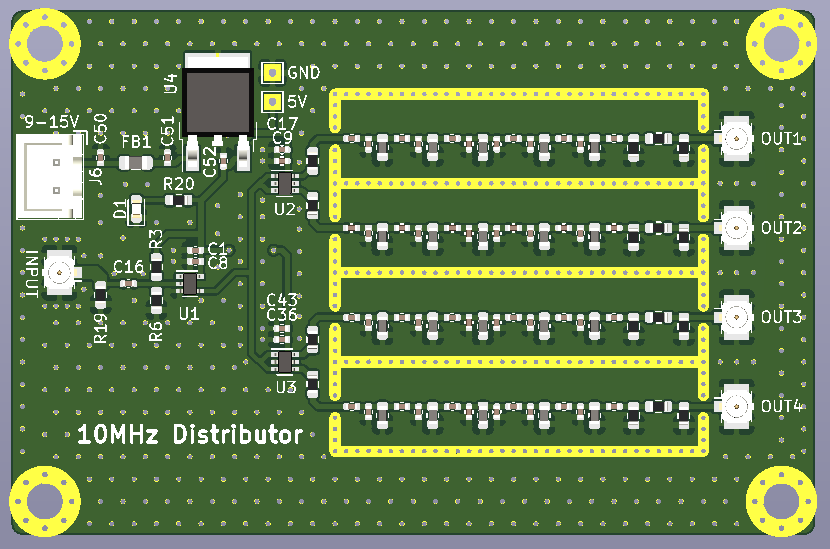
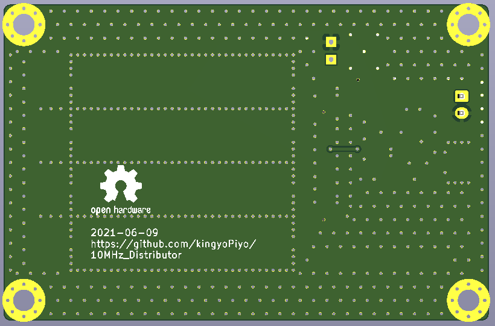
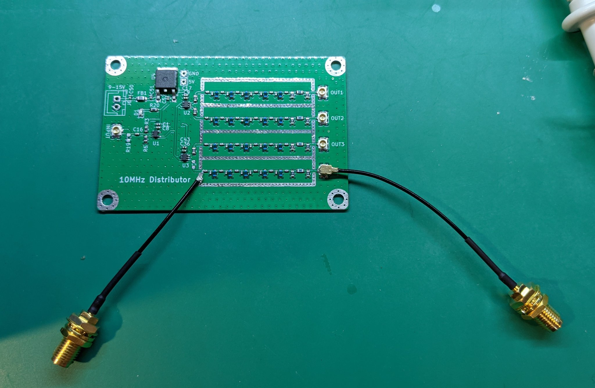

# 10MHz_Distributor(ver 0.1)
GPSDOなどの10MHz基準信号の分配基板です。  
出力部に5段のBPFを搭載しており、入力信号をバッファリング＆正弦波へ波形整形してから出力します。 
 
  
  

# 諸特性
インダクタのQ値が考慮できておらず、通過帯域での減衰量が非常に大きくなりました。  
インダクタを変更して再設計します。（続く・・・）  
* インダクタ：LQW18ANR47J00  
* Q値：5.5@10MHz  
* DCR：5.3Ω@10MHz  

  
  
